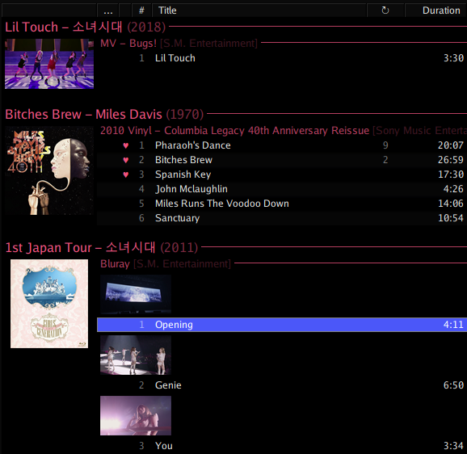

# foo_mpv
mpv video player UI element for foobar2000.


### Features
- For playback of local video files
- A/V sync should be approximately as fast and accurate as a standalone video player most of the time
- Optionally acts as an album art display when no video is available
- On-screen control based on mpv's, can be enabled/disabled per-UI element
- Thumbnail generator for providing album art for videos to foobar, with an on-disk cache
- Thumbnails are used as a fallback to other art sources, which allows mixing thumbnails and box art in different views, eg:


- Thumbnail picker for visually choosing a thumbnail for a video
- Algorithm for automatically choosing 'good' thumbnails
- DefaultUI element, Columns UI panel, standalone popup and fullscreen mode
- Single video instance moves to the largest currently visible UI element unless manually pinned to one area via the context menu, making it simple to switch between a small instance and larger instance in your layout
- Developed to work well in Wine
- Can read mpv.conf from `mpv/mpv.conf` in your foobar2000 profile folder
- Switch mpv configuration profiles at runtime via the context menu
- Mouse wheel can be bound in `mpv/input.conf` (but nothing else)

Be careful choosing options in mpv.conf. You probably don't want to override any of the options set by the component or performance might suffer. Good options to set might be scaling, video filters, deinterlacing, etc. You can specify different profiles for use when displaying video and album art using `[video]` and `[albumart]`. Any other profiles will be available to apply at runtime using the context menu. For example, a good place to start might be:

```
profile=gpu-hq   # use high quality scaling etc.

[video]
vf=bwdif:deint=1 # deinterlace videos automatically

[albumart]
vf=              # turn off video filters for album art so that PNG transparency works
```

The mpv profile folder is set to `<foobar profile>/mpv`, so you can use paths relative to this in `mpv.conf` by using `~~` as normal.

The synchronisation between foobar and mpv is somewhat less jarring if mpv finishes loading/seeking in the file first, as it will just wait on the first frame for the audio to catch up. If foobar begins playback first, the video will need to be sped up momentarily. Therefore it is preferable for mpv to load/seek within files as fast as possible, and enabling mpv's `low-latency` profile might help with this.
