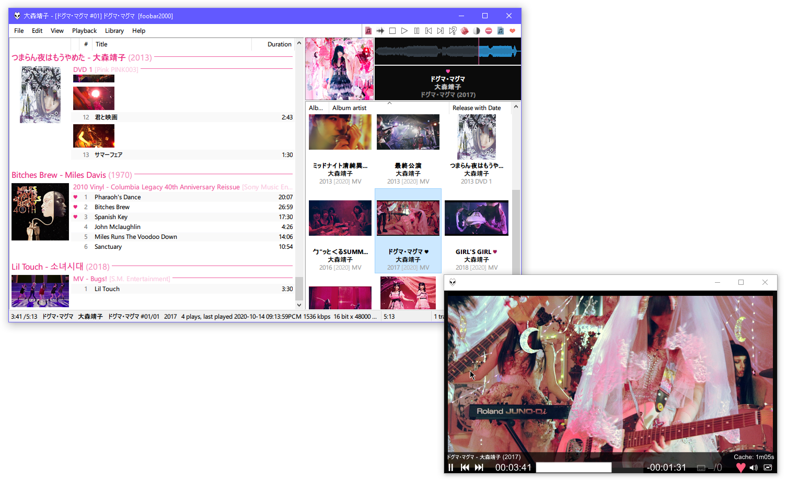

# foo_mpv
mpv video player UI element for foobar2000.

### Features
- Local files only
- Aims to quickly and very accurately sync video to the audio
- Supports files with chapters/subsongs
- DefaultUI element and popup (ColumnsUI panel later)
- Fullscreen via double click
- Works in Wine
- Can read mpv.conf from <Profile Folder>/mpv/mpv.conf

NB: go easy on the options in mpv.conf, you probably don't want to override any of the options set by the component or weird things might happen. Good options to set might be scaling, video filters, deinterlacing, etc. For example:

```
vf-append=bwdif:deint=1
scale=ewa_lanczos
```


